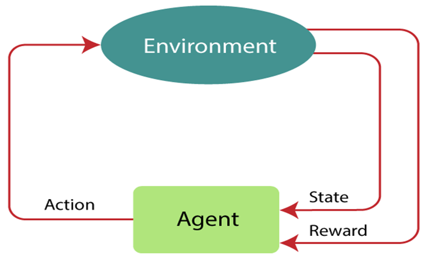
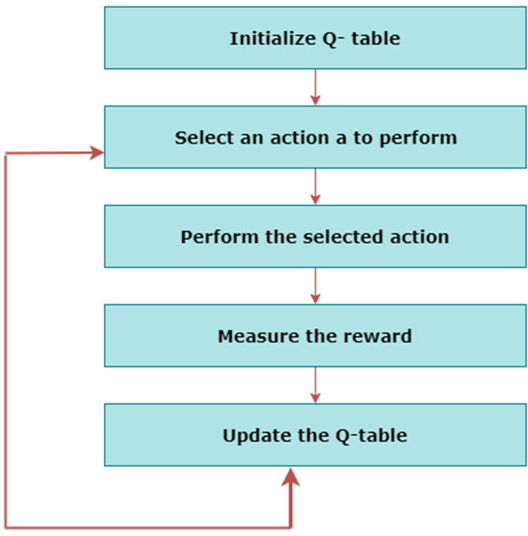
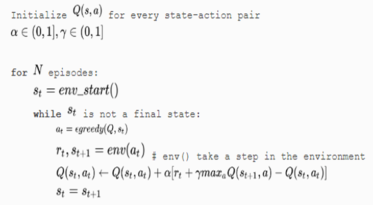
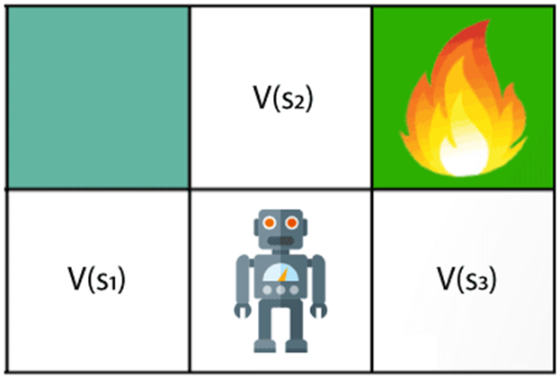
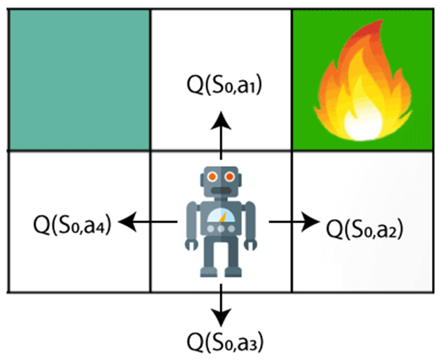
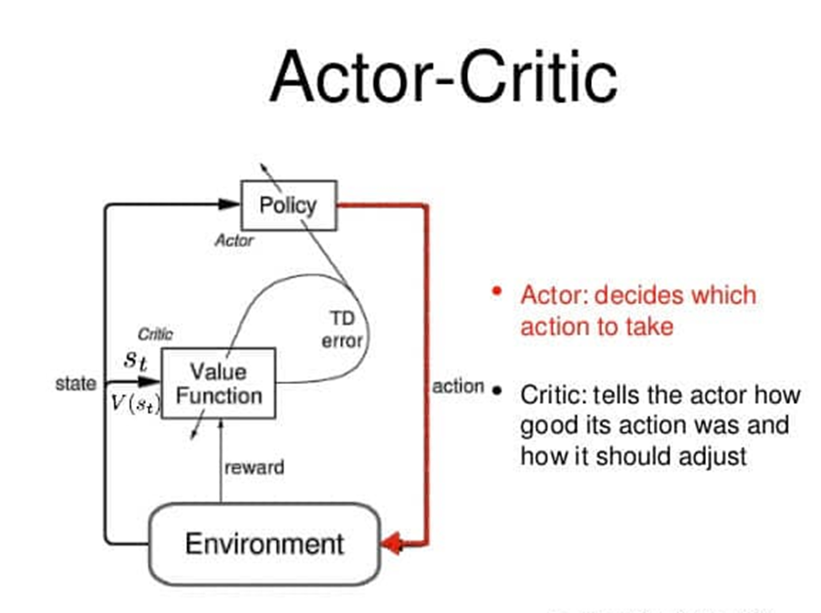
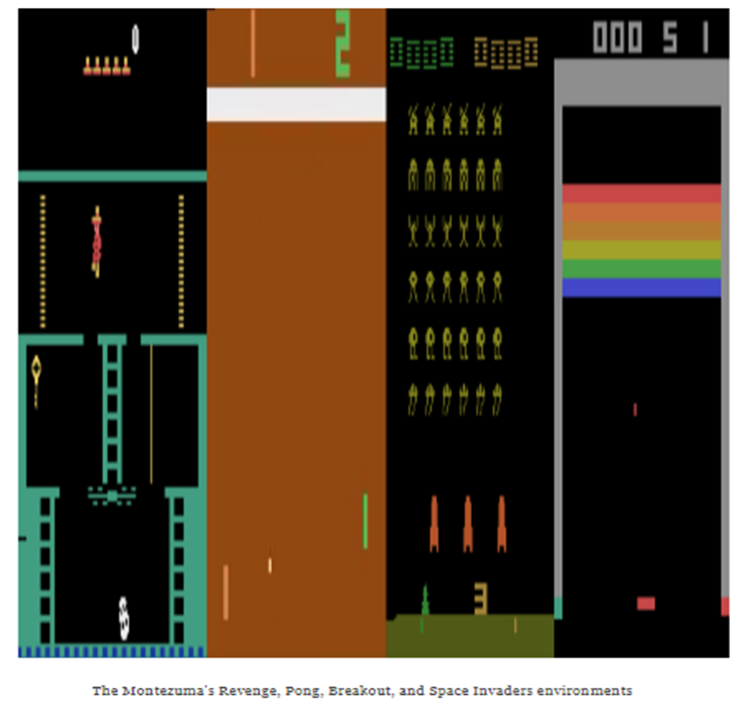
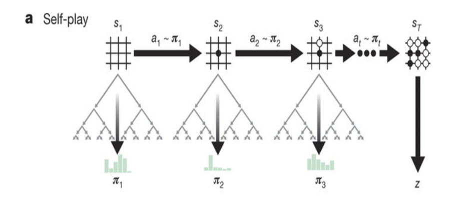
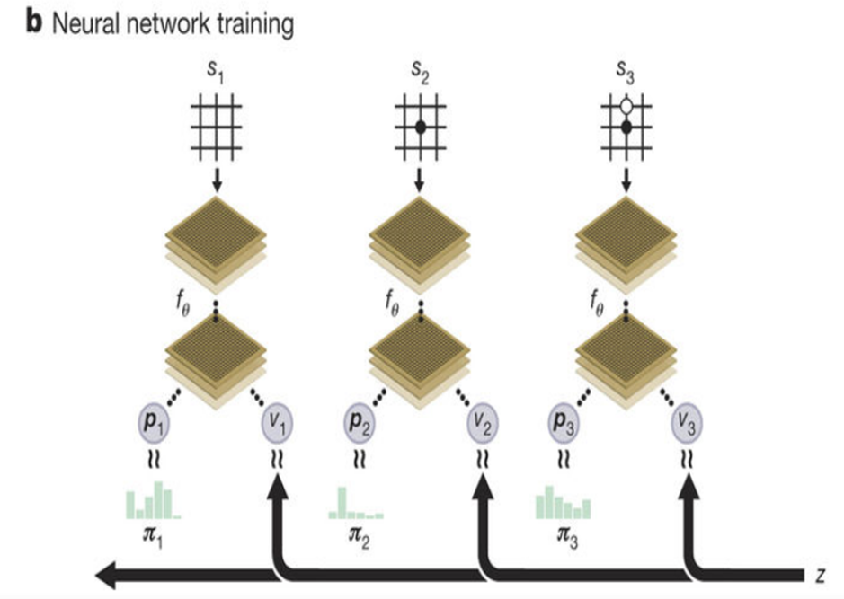
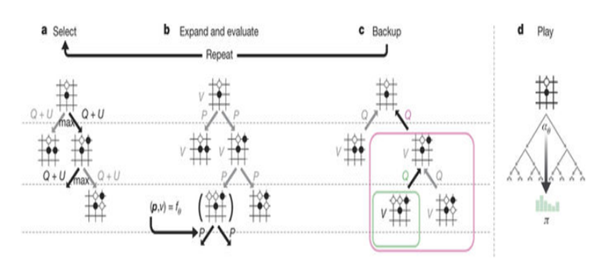

# Reinforcement Learning Algorithm

## 1. Markov Decision Process

Markov Decision Process or MDP, is used to formalize the reinforcement learning problems. If the environment is completely observable, then its dynamic can be modeled as a Markov Process. In MDP, the agent constantly interacts with the environment and performs actions; at each action, the environment responds and generates a new state.

MDP is used to describe the environment for the RL, and almost all the RL problem can be formalized using MDP.

MDP contains a tuple of four elements (S, A, Pa, Ra):

*	A set of finite States S
*	A set of finite Actions A
*	Rewards received after transitioning from state S to state S', due to action a.
*	Probability pa.

MDP uses Markov property, and to better understand the MDP, we need to learn about it.

##### Markov Property:

It says that "If the agent is present in the current state S1, performs an action a1 and move to the state s2, then the state transition from s1 to s2 only depends on the current state and future action and states do not depend on past actions, rewards, or states."

Or, in other words, as per Markov Property, the current state transition does not depend on any past action or state. Hence, MDP is an RL problem that satisfies the Markov property. Such as in a Chess game, the players only focus on the current state and do not need to remember past actions or states.

##### Finite MDP:

A finite MDP is when there are finite states, finite rewards, and finite actions. In RL, we consider only the finite MDP.

##### Markov Process:

Markov Process is a memoryless process with a sequence of random states S1, S2, ....., St that uses the Markov Property. Markov process is also known as Markov chain, which is a tuple (S, P) on state S and transition function P. These two components (S and P) can define the dynamics of the system.

## 2. ThreeTypes- Model,Value,Policy Based Approaches

There are mainly three ways to implement reinforcement-learning in ML, which are:
    
### 1.Value-based:
    
The value-based approach is about to find the optimal value function, which is the maximum value at a state under any policy. Therefore, the agent expects the long-term return at any state(s) under policy π.

### 2.	Policy-based:

Policy-based approach is to find the optimal policy for the maximum future rewards without using the value function. In this approach, the agent tries to apply such a policy that the action performed in each step helps to maximize the future reward.
The policy-based approach has mainly two types of policy:

* Deterministic: The same action is produced by the policy (π) at any state.
* Stochastic: In this policy, probability determines the produced action.

### 3.	Model-based: 

In the model-based approach, a virtual model is created for the environment, and the agent explores that environment to learn it. There is no particular solution or algorithm for this approach because the model representation is different for each environment.

### 3.Q-learning Algorithm

*	Q-learning is an Off policy RL algorithm, which is used for the temporal difference Learning. The temporal difference learning methods are the way of comparing temporally successive predictions.
*	It learns the value function Q (S, a), which means how good to take action "a" at a particular state "s."
*	The below flowchart explains the working of Q- learning:

##### The algorithm:

As Q-learning is a TD method, it needs a behavior policy that, as time passes, will converge to a deterministic policy. A good strategy is to use an e-greedy policy with linear or exponential decay 
To recap, the Q-learning algorithm uses the following:

* A target greedy policy that constantly improves
* A behavior e-greedy policy to interact with and explore the environment

After these conclusive observations, we can finally come up with the following pseudocode for the Q-learning algorithm:

In practice, $alpha$  usually has values between 0.5 and 0.001 and $gama$  ranges from 0.9 to 0.999

### 4. Positive and Negative Reinforcement:

Positive reinforcement increases the frequency of a behavior while negative reinforcement decreases the frequency. In general, positive reinforcement is the most common type of reinforcement used in reinforcement learning, as it helps models maximize the performance on a given task. Not only that but positive reinforcement leads the model to make more sustainable changes, changes which can become consistent patterns and persist for long periods of time.

In contrast, while negative reinforcement also makes a behavior more likely to occur, it is used for maintaining a minimum performance standard rather than reaching a model’s maximum performance. Negative reinforcement in reinforcement learning can help ensure that a model is kept away from undesirable actions, but it can’t really make a  model explore desired actions.

## 5. Policy Gradient(PG) Algorithm

Policy gradient methods or policy optimization methods have a more direct and obvious interpretation of the RL problem, as they learn directly from a parametric policy by updating the parameters in the direction of the improvements. It's based on the RL principle that good actions should be encouraged (by boosting the gradient of the policy upward) while discouraging bad actions.

   Policy optimization mainly requires on-policy data, making these algorithms more sample inefficient. Policy optimization methods can be quite unstable due to the fact that taking the steepest ascent in the presence of surfaces with high curvature can easily result in moving too far in any given direction, falling down into a bad region. To address this problem, many algorithms have been proposed, such as optimizing the policy only within a trust region, or optimizing a surrogate clipped objective function to limit changes to the policy.

   A major advantage of policy gradient methods is that they easily handle environments with continuous action spaces. This is a very difficult thing to approach with value function algorithms as they learn Q-values for discrete pairs of states and actions.

## 6. DEEP Q-Learning 

*	Q-learning is a popular model-free reinforcement learning algorithm based on the Bellman equation.
*	The main objective of Q-learning is to learn the policy which can inform the agent that what actions should be taken for maximizing the reward under what circumstances.
*	It is an off-policy RL that attempts to find the best action to take at a current state.
*	The goal of the agent in Q-learning is to maximize the value of Q.
*	The value of Q-learning can be derived from the Bellman equation. Consider the Bellman equation given below:
 
In the equation, we have various components, including reward, discount factor (γ), probability, and end states s'. But there is no any Q-value is given so first consider the below image:

In the above image, we can see there is an agent who has three values options, V(s1), V(s2), V(s3). As this is MDP, so agent only cares for the current state and the future state. The agent can go to any direction (Up, Left, or Right), so he needs to decide where to go for the optimal path. Here agent will take a move as per probability bases and changes the state. But if we want some exact moves, so for this, we need to make some changes in terms of Q-value. Consider the below image:

Q- represents the quality of the actions at each state. So instead of using a value at each state, we will use a pair of state and action, i.e., Q(s, a). Q-value specifies that which action is more lubricative than others, and according to the best Q-value, the agent takes his next move. The Bellman equation can be used for deriving the Q-value.

To perform any action, the agent will get a reward R(s, a), and also he will end up on a certain state, so the Q -value equation will be:

Hence, we can say that V(s) = max [Q(s,a)]

The above formula is used to estimate the Q-values in Q-Learning.

What is 'Q' in Q-learning?

The Q stands for quality in Q-learning, which means it specifies the quality of an action taken by the agent.

* Q-table:
    
    A Q-table or matrix is created while performing the Q-learning. The table follows the state and action pair, i.e., [s, a], and initializes the values to zero. After each action, the table is updated, and the q-values are stored within the table.
    
The RL agent uses this Q-table as a reference table to select the best action based on the q-values.

## 7.Actor-Critics Algorithm:

Actor-Critics aim to take advantage of all the good stuff from both value-based and policy-based while eliminating all their drawbacks. And how do they do this?

The principal idea is to split the model in two: one for computing an action based on a state and another one to produce the Q values of the action.

The actor takes as input the state and outputs the best action. It essentially controls how the agent behaves by learning the optimal policy (policy-based). The critic, on the other hand, evaluates the action by computing the value function (value based). Those two models participate in a game where they both get better in their own role as the time passes. The result is that the overall architecture will learn to play the game more efficiently than the two methods separately.

   This idea of having two models interact (or compete) with each other is getting more and more popular in the field of machine learning in the last years. Think of Generative Adversarial Networks or Variational Autoencoders for example.

   But let’s get back to Reinforcement Learning. A good analogy of the actor-critic is a young boy with his mother. The child (actor) constantly tries new things and exploring the environment around him. He eats its own toys, he touches the hot oven, he bangs his head in the wall (I mean why not). His mother (the critic) watches him and either criticize or compliment him. The child listen to what his mother told him and adjust his behavior. As the kid grows, he learns what actions are bad or good and he essentially learns to play the game called life. That’s exactly the same way actor-critic works.

   The actor can be a function approximator like a neural network and its task is to produce the best action for a given state. Of course, it can be a fully connected neural network or a convolutional or anything else. The critic is another function approximator, which receives as input the environment and the action by the actor, concatenates them and output the action value (Q-value) for the given pair. Let me remind you for a sec that the Q value is essentially the maximum future reward.

   The training of the two networks is performed separately and it uses gradient ascent (to find the global maximum and not the minimum) to update both their weights. As time passes, the actor is learning to produce better and better actions (he is starting to learn the policy) and the critic is getting better and better at evaluating those actions. It is important to notice that the update of the weights happen at each step (TD Learning) and not at the end of the episode, opposed to policy gradients.

   Actor critics have proven able to learn big, complex environments and they have used in lots of famous 2d and 3d games, such as Doom, Super Mario, and others.

## 8.Atari Game Application

Atari games became a standard testbed for deep RL algorithms since their introduction in the DQN paper. These were first provided in the Arcade Learning Environment (ALE) and subsequently wrapped by OpenAI Gym to provide a standard interface. ALE (and Gym) includes 57 of the most popular Atari 2600 video games, such as Montezuma's Revenge, Pong, Breakout, and Space Invaders, as shown in the following illustration. These games have been widely used in RL research for their high-dimensional state space (210 x 160 pixels) and their task diversity between games:

A very important note about Atari environments is that they are deterministic, meaning that, given a fixed set of actions, the results will be the same across multiple matches. From an algorithm perspective, this determinism holds true until all the history is used to choose an action from a stochastic policy.

## 9.AlphaGo  Application

AlphaGo is a software for the game of Go developed by Google DeepMind. It was the first software able to defeat a human champion in the game without a handicap and on a standard-sized goban (19 × 19).

AlphaGo represented a significant advancement over pre-existing go-to game programs. Over 500 games played against other software, including Crazy Stone and Zen—AlphaGo (running on a single computer) has won all but one game—and running a series of similar matches, but turning on an AlphaGo cluster has won all 500 games and won 77% of the games against itself performed on a single machine.

### Architecture and properties of AlphaGo Zero

There were five changes from the previous version of AlphaGo. They were as follows:

*	Trains entirely from self play that is no human experts game play data and learning everything from scratch. Earlier versions had supervised learning policy networks, which was trained on expert game plays.
*	No hand-crafted features.
*	Replaced the normal convolution architecture with residual convolution architecture.
*	Instead of a separate policy and value network, AlphaGo Zero has combined both of them into a single large network.
*	Simplified the Monte Carlo Tree Search, which uses this large neural network for simulations.

The network input consists of:

*	19 x 19 matrix plane representing the board of Go
*	One feature map for white stones (binary matrix having 1 in the positions having white stone and 0 elsewhere)
*	One feature map for black stones (binary matrix having 1 in the positions having black stone and 0 elsewhere)
*	Seven past feature maps for player using white stones (represents history as it captures the past seven moves)
*	Seven past feature maps for player using black stones (represents history as it captures the past seven moves)
*	One feature map for turn indication (turn can be represented by 1 bit but here it has been duplicated over the entire feature map)

Therefore, network input is represented by 19 x 19 x (1+1+7+7+1) = 19 x 19 x 17 tensor. The reason behind using feature maps of the past seven moves is that this history acts like a attention mechanism.

Why do we use residual architecture instead of normal convolution architecture? The reason behind this is that a residual architecture allows the gradient signal to pass straight through layers. Moreover, even during early stages of learning where convolution layers are not doing anything useful, then the important learning signals go into the convolution layers and go straight into further layers. Explaining residual architecture in detail is beyond the scope of this article.

Thus, we take an input of 19 x 19 x 17 tensor representation of the board and pass it through a residual convolution network, which generates a feature vector. This feature vector is passed through fully connected layers resulting in final feature extraction, which contains two things:

*	Value representation: Probability of AlphaGo Zero winning the game in the current board position.
*	Policy vector: Probability distribution over all the possible moves AlphaGo can play at the current position.

The goal therefore would be to obtain higher probability for good moves and lower probability for bad moves. In reinforcement learning, training a network by self playing a game of such higher complexity often leads to a network being highly unstable. Here, the simplified Monte Carlo Tree Search performs the task of stabilization of the network weights.

#### Training process in AlphaGo Zero 

Input of the board representation is received, which is a 19 x 19 x 17 tensor. It is passed through a residual convolution network then fully connected layers finally output a policy vector and a value representation. Initially, the policy vector will contain random values since the networks start with random weights initially. Post obtaining the policy vector for all possible moves for the given state, it selects a set of possible moves having very high probabilities, assuming that the moves having the high probabilities are also potentially strong moves:

Based on those selected sets of moves, different games states are received each corresponding to their move. Since you simulate playing those moves on the previous state, this results in a bunch of different states. Now, for these next sets of state, repeat the preceding process by inputting the representation tensor for these game states and obtain their policy vectors.

Thus, for the current board position this repetitive process will explode into a giant tree. More simulations are run, and the tree will expand as the expansion is exponential. Thus, the idea would be to explode this search tree to a certain depth because owing to limited computation power further search wont be possible. 

The AlphaGo team decided to play about 1600 simulations for every single board position evaluation. Therefore, for every single board state a Monte Carlo Tree Search is going to run until 1600 simulations are obtained. After which, a value network decides which of the resulting board positions is the best, that is, has the highest probability of winning. Then backup all those values to the top of the tree till the current game state (that is current board position which is being evaluated) and receive a very strong estimate for the moves that are genuinely strong and which are not.

Thanks for Reading ! @ Bindu G
